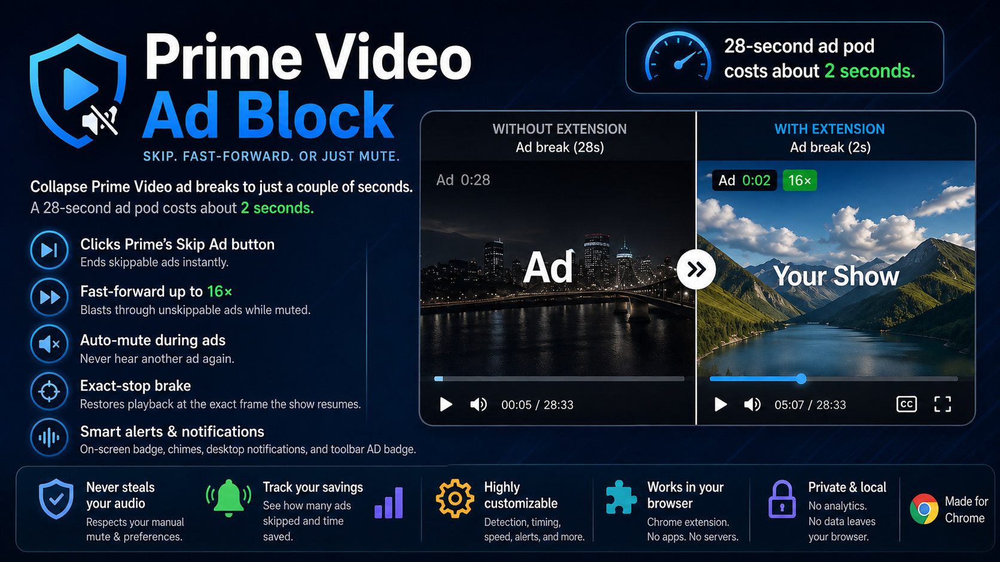

# Prime Video Ad Block Extension

A Chrome (Manifest V3) extension that **collapses Prime Video ad breaks**. It skips them
outright when Prime offers a Skip button, blows through them silently at up to 16× when it
doesn't, and hands your sound back at the exact frame the show resumes.

A 28-second ad pod costs about 2 seconds.



## What it does

Three mechanisms, tried in order of how much they save you:

| | |
|---|---|
| **Skip** | Clicks Prime's own **Skip Ad** button whenever the player renders one. The break ends immediately. Sanctioned by the player itself — this is the same button you would click. On by default. |
| **Fast-forward** | For breaks with no Skip button, plays the ad at speed while muted. At 12× a 30-second ad is gone in 2.5 s. Off by default; turn it on in the popup. |
| **Mute** | Silences the player the instant a break is detected, whichever of the above applies. |
| **Exact-stop brake** | Hands the rate back at the *frame* the break ends, so you never fast-forward into your own show. See [below](#the-exact-stop-brake) — this is the fiddly part. |
| **Auto-unmute** | Restores sound after the break, with a short grace delay so it doesn't flap between ads in the same pod. |
| **Never steals your audio** | If you were already muted, it leaves you muted. If you unmute by hand mid-ad, it stands down for that break. |
| **Fallback ladder** | If the browser rejects the rate, or the player keeps resetting it, the extension demotes itself to muting for the rest of the page load rather than fighting. |
| **Safety release** | If an ad signal ever gets stuck, the mute is released automatically after 10 minutes — a bad selector can never silence a whole film. |
| **Alerts** | On-screen badge over the player (with countdown), optional chime when the show returns, optional desktop notifications, and an `AD` badge on the toolbar icon. |
| **Stats** | How many ads it handled and how much time it saved. |

### What it cannot do

Prime stitches ads into the same video stream as the feature — server-side, sharing one
continuous timeline — so there is nothing client-side to block. **The ad data still
downloads and the break still occupies the timeline; this extension makes it take almost no
time and make no sound.** When Prime renders a Skip button, the break is genuinely skipped.
When it doesn't, fast-forward is the ceiling. See
[Why it can't just delete the ads](#why-it-cant-just-delete-the-ads).

## Install (unpacked)

The extension needs no build step — the source *is* the extension.

1. `chrome://extensions`
2. Turn on **Developer mode** (top right)
3. **Load unpacked** → select this repository folder
4. Open a Prime Video title and press play

To produce a zip for the Chrome Web Store: `npm run pack` → `dist/prime-video-ad-block-1.0.0.zip`.

### Permissions

Installing asks for `storage` and access to Prime Video pages. Nothing else.
`tabs` (whole-tab muting) and `notifications` (desktop alerts) are **optional** permissions,
requested only if you switch those features on.

The extension makes no network requests, has no analytics, and stores your settings in
Chrome's own sync storage. Nothing leaves the browser.

## Settings

Click the toolbar icon for the common toggles, or **All settings** for the rest.

**Ad breaks** — action (`mute` (default) / `mute and fast-forward`) · fast-forward speed
(default 8×; Chrome throws above 16) · check interval during a break (default 100 ms) ·
click Prime's own Skip Ad button

**Muting** — master switch · mute during ad breaks · respect a manual unmute ·
what to mute (`video element` (default) / `whole tab` / `both`)

**Alerts** — on-screen badge · countdown in the badge · chime on ad start / ad end ·
desktop notification on ad start / ad end · toolbar `AD` badge

**Timing** — delay before muting (default 0 ms) · delay before unmuting (default 500 ms) ·
safety release (default 10 min) · check interval (default 400 ms)

**Detection** — broad class heuristic · extra CSS selectors · extra text patterns ·
debug mode (console logging) · on-screen readout (the status panel over the player)

**Backup** — export / import settings JSON · reset to defaults

## How detection works

Every 400 ms — 100 ms during a break, 2 s when there's no player on the page — the content
script takes a cheap snapshot and hands it to a pure state machine:

```
detect.probe()  ──▶  { adSignal, signals, remainingSec, isMuted }
                          │
                          ▼
   stateMachine.decide(state, input)  ──▶  [ mute | unmute | setRate | restoreRate
                          │                  | adStart | adEnd | userOverride ]
                          ▼
     main.js applies them (mute, rate, skip click, toast, chime, notify, badge, stats)
```

Signals, in the order they are tried (first hit wins, so the cheap ones run first):

1. **Selectors** — the live ad-timer family: `[class*="atvwebplayersdk-ad-timer"]` (prefix
   match, because `-ad-timer-text` and `-ad-timer-remaining-time` are A/B-tested against each
   other and both ship), `.atvwebplayersdk-ad-timer-remaining-time`,
   `.atvwebplayersdk-ad-timer-ad-text`, `.atvwebplayersdk-skip-ad-button`, and
   `[aria-label*="playing ad"]`. Each must be *visible* and carry text.
2. **Text** — the player overlay's visible text. The live timer renders as `Ad0:20`, so the
   obvious `\bad\b\s*\d+:\d\d` does **not** match it (there's a test for that). The locale
   alternation also catches `Anuncio0:20` / `Werbung0:15`, which is what kept detection alive
   outside en-US when the English selectors died. Runs only when no selector matched, reads
   only inside the player container, and is tuned not to fire on "Skip Intro", "Skip Recap",
   "Next episode in 10 sec", "Add 0:20" or "Loaded 1:05".
3. **Broad class heuristic** (off by default) — any visible element in the player whose class
   carries an `ad` / `ads` token.

A **denylist** overrides all three: the permanent `atvwebplayersdk-go-ad-free-button` upsell
(which the heuristic's token regex otherwise matches on every frame of every title), the
`ad-resume-message` (it reports a box while CSS-hidden), and the skip-**intro** button.

Two things can still blind every selector, so detection is best-effort by design: the ad-timer
subtree only mounts when the ad's VAST sets `showCountdownTimer`, a per-ad server field; and a
second player UI ships with hashed CSS-module classnames and no `atvwebplayersdk-ad-*` hooks at
all. When nothing matches, nothing happens — ads simply play with sound, which is the correct
failure, not a bug.

### The exact-stop brake

Fast-forward is easy; *stopping* is the hard part. The DOM poll runs on a wall clock, but the
cost of its lag is paid in stream time, so it scales with the rate: at 12×, a 100 ms tick
overshoots the end of the break by **1.2 s of your show**, fast-forwarded and muted. Raising
the speed made the overshoot worse.

Because Prime's ads share one continuous timeline with the feature, `video.currentTime` is
authoritative: a break reporting 20 s left ends at exactly `currentTime + 20`. So the brake

- **anchors on the counter's decrement edge**, not on a raw reading. A single reading of an
  integer counter is a second wide; the instant it flips 21 → 20 there really are 20.0 s
  left, and every edge in the pod sharpens the estimate.
- **rides a `requestVideoFrameCallback` loop** down to that target and restores the rate on
  the frame that crosses it. rVFC fires per *presented* frame, so its granularity is
  frame-rate bound in stream time — about 40 ms — **no matter what rate you set.** 16×
  costs no more overshoot than 8×.

It deliberately restores only the **rate**. Unmuting stays signal-driven: braking a beat
early costs a second of ad at 1× (silent, harmless), whereas unmuting early would play ad
audio, which is the one thing this extension exists to prevent. The error budget is spent on
silence, never on noise.

### When Prime Video changes their player

They rename these classes periodically — that is the one maintenance job this extension has.

1. Settings → **On-screen readout** on (and **Debug mode** if you also want console logging)
2. Play something until an ad runs; a readout appears in the bottom-left of the player
   showing which signals fired (`-` means none did)
3. Right-click the ad countdown / "Ad" badge → Inspect, and copy a selector for it
4. Paste it into **Extra CSS selectors**, one per line — it takes effect immediately, no reload

If the ad overlay carries distinctive *text* instead, add a regex to **Extra text patterns**.

## Why it can't just delete the ads

Prime ships two different ad architectures — SSAI period stitching, and "EXPL" playlisting —
and the ads are inserted **server-side** into the same manifest and the same presentation
timeline as the feature. There is no separate ad request to block, which is also why
network-level blocking (Pi-hole, DNS blocklists, router rules) cannot help: block the ad
segments and you block the film.

The two techniques that would genuinely remove ads — DASH `Period` pruning and
playback-resource JSON rewriting — each cover only *one* of the two architectures, require
rewriting the manifest in flight, and fail to a black screen rather than to silence. A naive
pruner also strips studio logos and "Previously On" recaps, which share the same period
subtype family as ads.

Seeking past a break is likewise not shipped: it is documented to stall and to overshoot
5–30 s into the feature, and it doesn't work at all on EXPL-playlisted titles. Fast-forward
degrades to muting; a bad seek degrades to a broken player.

So: skip when Prime lets you, fast-forward when it doesn't. That combination always works,
never fights the player, and cannot leave you staring at a black screen.

## Limitations

- **Browser only.** It cannot touch ads on a Fire TV, smart TV, console, or the Prime Video
  app. Those platforms run native players with no DOM and no extension support.
- **The break still exists.** It is skipped, or silenced and compressed to a couple of
  seconds — not removed from the stream.
- **Detection depends on Prime's markup.** When that changes, add a selector (above) rather
  than waiting for an update.
- Prime Video inside an iframe on a storefront page is covered (`all_frames: true`), but the
  script only acts in a frame that actually has a `<video>`.

## Development

```bash
npm install           # jsdom, for the DOM-probe tests only — the extension itself has no deps
npm test              # 62 tests: state machine, parsers, brake, DOM probe (jsdom), structure
npm run manifest      # regenerate manifest.json (edit the domain list in tools/gen-manifest.mjs)
npm run icons         # redraw the PNG icons (no image deps — zlib only)
npm run pack          # zip for the Chrome Web Store
```

```
manifest.json                     generated — do not hand-edit
src/common/defaults.js            settings + built-in signal definitions
src/common/state-machine.js       pure decide(), rate watchdog, exact-stop brake maths
src/content/detect.js             DOM probing (thin, cheap, short-circuiting)
src/content/main.js               applies actions: mute, rate, skip click, toast, badge, stats
src/background/service-worker.js  toolbar badge, notifications, tab mute, stats
src/options/, src/popup/          UI
tools/                            manifest / icon / zip generators
test/                             node:test + jsdom — no browser needed
```

The split is deliberate: every decision is a pure function of `(state, input)`, so the
awkward cases — ad pods with gaps, you muting first, you unmuting mid-ad, the extension
being switched off mid-break, a stuck signal, the brake's boundary condition — are all
covered by tests that run in Node without a browser. The rate ownership added for
fast-forward has one hard requirement, pinned by tests: the film is never left running at
speed. `test/detect.test.js` then drives the real probe over Prime-shaped markup in jsdom,
including the "Amazon renamed the class" recovery path.

## Disclaimer

This is an independent hobby project. It is **not affiliated with, endorsed by, or
connected to Amazon** in any way. "Prime Video" and "Amazon" are trademarks of their
respective owners and are used here only to describe what the extension interoperates
with.

The extension does not decrypt, circumvent, or strip anything. It clicks the player's own
"Skip Ad" button, and otherwise controls the volume and playback rate of the video element
in your own browser. It makes no network requests, contains no analytics, and stores your
settings in Chrome's sync storage — nothing leaves your browser.

Provided as-is under the MIT licence, with no warranty.

## Licence

[MIT](LICENSE).
